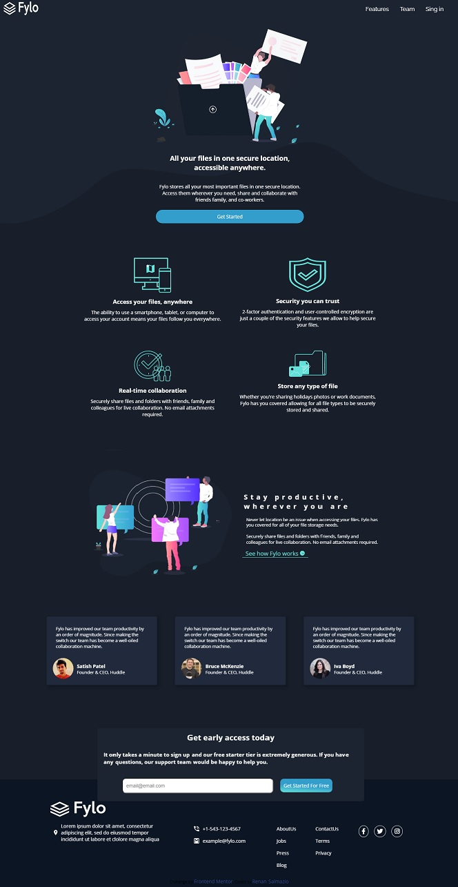
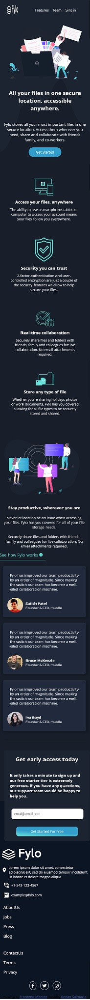

# Frontend Mentor - Fylo dark theme landing page solution

This is a solution to the [Fylo dark theme landing page challenge on Frontend Mentor](https://www.frontendmentor.io/challenges/fylo-dark-theme-landing-page-5ca5f2d21e82137ec91a50fd). Frontend Mentor challenges help you improve your coding skills by building realistic projects. 

## Table of contents

- [Overview](#overview)
  - [The challenge](#the-challenge)
  - [Screenshot](#screenshot)
  - [Links](#links)
  - [Built with](#built-with)
  - [Useful resources](#useful-resources)
- [Author](#author)

## Overview

### The challenge

Users should be able to:

- View the optimal layout for the site depending on their device's screen size 375px and 1440px
- See hover states for all interactive elements on the page

### Screenshot

#### Desktop

##### mobile

### Links

- Solution URL: [github](https://github.com/RenanDevWeb/frontEndMentorFyloDarkTheme)
- Live Site URL: [live solution](https://renandevweb.github.io/frontEndMentorFyloDarkTheme/)

### Built with

- Semantic HTML5 markup
- CSS custom properties
- Flexbox
- Mobile-first workflow

## Author

- Website - [Renan Salmazio](https://renandevweb.github.io/Renandevv/)
- Frontend Mentor - [@RenanDevWeb](https://www.frontendmentor.io/profile/RenanDevWeb)

